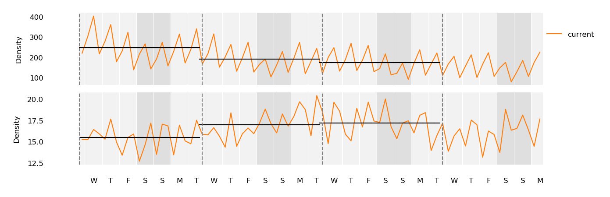
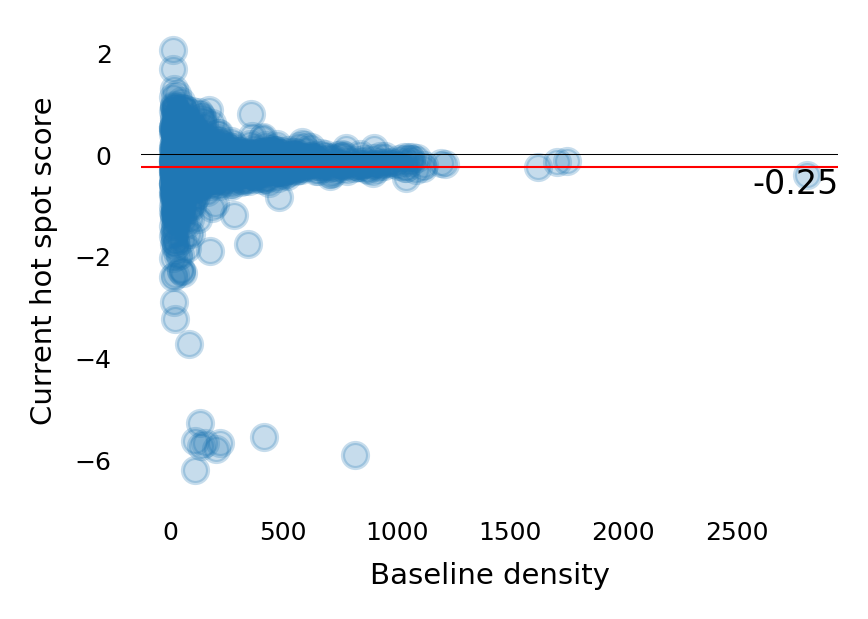

Providing social distancing situational awareness during the COVID-19 pandemic in Colorado

## Table of contents
   * [Setup](#setup)
   * [Methods](#methods)
      * [Weekend Score](#weekend-score-)
      * [Slip Score](#slip-score-ss-)
      * [Trends](#trends)
      * [Hot Spots](#hot-spots-)
   * [Interactive Data Browser](#tests)


## Setup
- Set up conda environment
```
$ conda env create -f environment.yml
$ conda activate COvid19
```
- Download Facebook Population (Tile Level) files to `pop_tiles/orig`
- From `pop_tiles` run 
```
$ bash fix_files.sh
```
- Create the database
```
$ python src/csv_to_sql.py --csv pop_tiles/ --db colorado.db
rm -f colorado.db;sqlite3 colorado.db < tmp.sql
$ rm -f colorado.db;sqlite3 colorado.db < tmp.sql
```
- Get scores aggregated by a field in a shapefile, here we will use cities in Colorado.
```
$ python src/get_all_scores_by_shape.py \
    --db colorado.db \
    --shapefile shapefiles/Colorado_City_Boundaries/ \
    --shapename NAME10 \
> colorado_city_scores.`date "+%Y%m%d"`.txt
```

## Methods
On March 24th, 2020 at 1800 MNT, our team started collecting data from Facebook
Data for Good (https://dataforgood.fb.com/) that covers Utah and Colorado.
Facebook provides aggregated and anonymized user density data for 2km x  2km
tiles at three timepoints per day (0200 MNT, 1000 MNT, and 16000 MNT). To help
protect privacy, density data is not reporting when a tile has fewer than 10
users. In addition to the current density data, which is referred to as the
crisis density, Facebook also gives the baseline density for each tile and time
point that is the average density of that tile at the day and time for the 6
weeks prior to the start of the crisis (March 25th, 2020).

With 78 observations per tile and counting, we can track changes in population
density over time to infer behavior. For example, comparing crisis and baseline
densities can show how patterns have changed after stay-at-home orders were
issued and comparing one crisis week to the next can show if the new patterns
are holding.


*Baseline (blue) and current (orange) population densities for one tile in Salt
Lake City. The current data starts on Tuesday, March 24, 2020, at 1800 MNT. The
last time point shown is March 18, 2020, at 1000 MNT, but we continue to
collect new data. Each day (shaded grey) includes time points at 0200, 1000,
and 1800. Weekends are darkened.*
```
python src/plot_one.py \
    -i colorado_city_scores.20200422.txt \
    -o imgs/Boulder_example_tile.png \
    --shapename "Boulder" \
    --width 5 -n 5 --height 1
```

## Weekend Score ()

Most regions show a regular weekly pattern. Economic centers are denser on the
weekdays, residential areas are denser on the weekends, and recreational areas
are more consistent. To measure these differences we developed the weekend
score  that
compares the average weekday density

to the average weekend density 


)

Areas with higher positive values have more weekday activity and areas with
lower negative values have more weekend activity.


*Baseline and current population densities for an economic center (top, baseline ws = 1.48 ), a residential area (middle, baseline ws = -0.21), and a ski area (bottom, baseline ws = -0.06). Average weekday and weekend activity levels are given by horizontal black lines.*
```
$ python src/ws_scores.py \
    -i colorado_city_scores.20200422.txt \
| sort -t$'\t' -k 5,5g \
| tail -n 1
449	Boulder	40.069664004427	-105.21606445312	1.0568428725333567	0.5266777645208203	0.5424389724825188	0.4402530723582583

$ python src/ws_scores.py \
    -i colorado_city_scores.20200422.txt \
| sort -t$'\t' -k 5,5gr \
| tail -n 1
1322	Grand Lake	40.254376084285	-105.83129882812	-0.5717760132754274	-0.12254129829560738	0.005638648006131584	-0.011023686029626615

$ python src/ws_scores.py \
    -i colorado_city_scores.20200422.txt \
    -o  imgs/colorado_example_tile_ws_diffs.png \
    -n 449,1322 \
     --width 5 --height 2.5 > /dev/null
```

We can track changes in behavior by comparing the scores between weeks.

*Weekend score distributions for baseline, week 1, week 2, and week 3.*

```
$ (python src/ws_scores.py -i colorado_city_scores.20200422.txt | cut -f5 | paste -sd '\t' - ; \
python src/ws_scores.py -i colorado_city_scores.20200422.txt | cut -f6 | paste -sd '\t' - ; \
python src/ws_scores.py -i colorado_city_scores.20200422.txt | cut -f7 | paste -sd '\t' - ; \
python src/ws_scores.py -i colorado_city_scores.20200422.txt | cut -f8 | paste -sd '\t' - ;) \
| src/hist.py \
    -x 'Baseline ws,Week 1 ws,Week 2 ws,Week 3 ws' \
    -y 'Freq' \
    -b 50 \
    --width 8 \
    --height 2 \
    -o imgs/colorado_ws_baseline_hist.png
```

We can also track the change in the behavior of individual tiles. In the plots
below, each point is a tile and its size corresponds to the mean baseline
density. Points further to the left or higher indicate more weekday activity.
The closer a point is to the red trend line, the more similar the activity
between the two weeks. This plot also shows a change from the baseline toward
more consistent behavior between the weekdays and weekends. 

|  |  |  |
| --- | --- | --- |

*A comparison of how weekend scores change between weeks. Here, each point is a
tile and the point size corresponds to the population density of the tile.
Larger points are denser than smaller points. Larger positive values (right and
up) indicated more weekday activity and negative values (left and down)
indicate more weekend activity. The red diagonal line is a reference to judge
the change between weeks. The closer a point is to the line the more similar
the weekday/weekend behavior was between the weeks.*


```
$ python src/plot_ws_x_ws.py \
    -i colorado_city_scores.20200422.txt \
    -o imgs/colorado_ws_baseline_week1.png \
    --x_axis 0 \
    --y_axis 1 \
    -x 'Baseline ws' \
    -y 'Week 1 ws' \
    --width 2 \
    --height 2 \
    --alpha 0.25

$ python src/plot_ws_x_ws.py \
    -i colorado_city_scores.20200422.txt \
    -o imgs/colorado_ws_week1_week2.png \
    --x_axis 1 \
    --y_axis 2 \
    -x 'Week 1 ws' \
    -y 'Week 2 ws' \
    --width 2 \
    --height 2 \

$ python src/plot_ws_x_ws.py \
    -i colorado_city_scores.20200422.txt \
    -o imgs/colorado_ws_week2_week3.png \
    --x_axis 2 \
    --y_axis 3 \
    -x 'Week 2 ws' \
    -y 'Week 3 ws' \
    --width 2 \
    --height 2 \
    --alpha 0.25
```

## Slip score (ss) ()

The behavior of a region after a stay-at-home order is issued depends on the
region’s demographics, which complicates monitoring. For example, economic
centers will be less dense, and residential centers will be denser since most
people are not working or traveling. To track how well regions are adhering to
their new patterns we developed a slip score 
. 
This metric assumes that adherence to these orders is best immediately
following their issuance, then tracks changes by comparing the average weekly
density 

 of consecutive weeks,

)

Areas with higher positive values are more active in the second week, and areas with lower negative values are less active.


*Current population densities for two tiles. Average weekly activity levels given by black bars. The slip from week one to week two in the top plot is 0.26 and in the slip for the same interval in the bottom plot is -0.12.*
```
$ python src/slip_scores.py -i colorado_city_scores.20200422.txt |  sort -t$'\t' -k 6,6gr | tail -n 2
898	Denver	39.85072040685	-104.64477539062	-1.6940531813681654	-0.34439512740216777	-0.14734599550209554
75	Denver	39.85072040685	-104.66674804688	-1.7213356921544296	-0.36289944951227465	-0.15109396965145458
$ python src/slip_scores.py -i colorado_city_scores.20200422.txt |  sort -t$'\t' -k 6,6g | tail -n 2
1433	Estes Park	40.338169932441	-105.52368164062	-0.36696575466368675	0.13152468685241248	0.020371124969622872
939	Fort Garland	37.431249993417	-105.43579101562	0.18350282216948896	0.1715863040811286	-0.014918557314476904

$ python src/slip_scores.py \
    -i colorado_city_scores.20200422.txt \
    -o  imgs/coloreado_example_slip_scores.png \
    -n 75,1433 \
    --width 5 \
    --height 1.5
```

To track individual regions, we can visualize the slip score with respect to the region size. In the plots below, each point is a tile, and points from denser regions are to the right are. Points above the zero line have slipped into a more active state, and points below the line have become less active.


|  |  |
| --- | --- |

*Slip scores from week 1 to week 2 (left) and from week 2 to week 3 (right). Positive values indicate an increase in week-to-week activity and negative values indicate a decrease.*

```
$ python src/plot_split_x_density.py \
    -i colorado_city_scores.20200422.txt \
    -o imgs/colorado_ss_week1_week2.png \
    --alpha 0.25 \
    --width 3 \
    --height 2 \
    --weeks 1,2 \
    -x 'Baseline density' \
    -y 'Week 1 to week 2 slip' 

$ python src/plot_split_x_density.py \
    -i colorado_city_scores.20200422.txt \
    -o imgs/colorado_ss_week2_week3.png \
    --alpha 0.25 \
    --width 3 \
    --height 2 \
    --weeks 2,3 \
    -x 'Baseline density' \
    -y 'Week 2 to week 3 slip' 
```

## Trends

Density data can be represented as a time series with repeating short-term
patterns (seasons) and the overall value increases or decreases (trends). Using
a model, we can decompose a series into its seasons and trends, which provides
a means to compare tiles with different weekday/weekend activities (seasons).


*Density data from four tiles decomposed into their patterns and trends.*

```
$ python src/trends.py     -i colorado_city_scores.20200422.txt |  sort -t$'\t' -k 5,5g  | tail -n 2
285	Denver	39.749433173953	-104.99633789062	88.32601055634723	88.32601055634723
74	Denver	39.85072040685	-104.66674804688	128.1883336281206	128.1883336281206
$ python src/trends.py     -i colorado_city_scores.20200422.txt |  sort -t$'\t' -k 5,5gr  | tail -n 2
1305	Aurora	39.71563761708	-104.79858398438	-21.203709164342058	21.203709164342058
494	Colorado Springs	38.831149294861	-104.75463867188	-26.088910442348492	26.088910442348492

$ python src/trends.py \
    -i colorado_city_scores.20200422.txt \
    -o  imgs/colorado_example_season_trend_split.png \
    -n 285,74,1305,494 \
    --width 5 --height 4 > /dev/null
```

Even within a city, we can observe the differences in density dynamics between
the business centers, which should be less dense during a stay-at-home order,
and residential centers, which should be denser. To capture the overall trend
of a city, we take the mean of each tile’s trend weighted by the tile’s
baseline density.


|  | 
|  |
| --- |

* Tile trends for two cities. Blue lines trend toward less density and red lines trend toward more. The line thickness corresponds to the tile’s baseline density. The black line is the mean trend weighted by population density.  *

```
$ python src/plot_shape_trend.py \
    -i colorado_city_scores.20200422.txt \
    --shapename "Denver" \
    -o imgs/Denver_trend.png \
    --width 5 \
    --height 2 \
    --title "Denver"

$ python src/plot_shape_trend.py  \
    -i colorado_city_scores.20200422.txt \
    --shapename "Colorado Springs" \
    -o imgs/Colorado_Springs_trend.png \
    --width 5 \
    --height 2 \
    --title "Colorado Springs"
```

The mean trends for cities can be combined for a county-level view.


*County-level trends. Each line is the weighted average for tiles trends in a city. Blue lines trend toward less density and red lines trend toward more. The line thickness corresponds to the tile’s baseline density.*
```
$ boulder_co_cities="Boulder,Erie,Jamestown,Lafayette,Longmont,Louisville,Lyons,Nederland,Superior,Ward"
$ python src/plot_shapes_mean_trend.py \
    -i colorado_city_scores.20200422.txt \
    --shapenames "$boulder_co_cities" \
    -o imgs/boulder_co_cities_mean_trends.png \
    --width 3 \
    --height 2
```

## Hot spots ()

Assuming that stay-at-home adherence was at its best the week after an order
was issued (week 1), then we define "hot spots" as regions with significantly
higher density levels relative to that baseline.  To reduce the effects of
outliers we use a 3-day mean, and to control for weekend/weekday effects we
match days of the week when comparing current and week one values.

The hot-spot ()
score for a tile is the difference between the current 3-day mean
()
and the 3-day mean from the same starting day in the first week
()
divided by standard deviation of 3-day means for other similarly dense tiles
().

/\hat{\sigma})


*Hot spot scores for three tiles. The hot spot score (blue) is the difference between the current 3-day mean(black horizontal) and the week one 3-day mean with the same start day divided by the variance (black vertical). The three examples here show a hot spot (a significant increase over week one), a neutral spot (no significant change from week one), and a cold spot (a significant decrease over week one).*
```
python src/hot_spot_scores.py \
    -i colorado_city_scores.20200422.txt \
    -o imgs/colorado_hotspot_scores.png \
    -n 938,720,54 \
    --width 5 \
    --height 3 \
    --ymin -7 \
    --ymax 7

```


We are using a broader set of tiles to calculate

because we have been collecting data for only a few weeks, and we have
relatively few observations for a given tile. To increase the number of samples
used to calculate the standard deviation, we fit a linear model to the mean
density and standard deviation of all tiles, then use that model to predict the
variance for the current tile.


*The mean and standard deviation of all tiles, and the linear model fit to the data.*

```
python src/density.py \
    -i colorado_city_scores.20200422.txt \
    -o imgs/colorado_mean_x_variance.png \
    --height 2 \
    --width 7
```

Hot spot scores can either as plotted as a histogram, with respect to baseline
density, or as a map (via shapefile).
|  |  |   |
| --- | --- | --- |

*Hot-spot scores for every tile. Positive values indicate that the current
density is higher today than it was in the first week. Negative values indicate
the current density is less. Left: Plotted versus baseline density. Right: Viewed as
as shapefile*

```
python src/hot_spot_scores.py \
    -i colorado_city_scores.20200422.txt \
| cut -f6 \
| paste -sd '\t' - \
| src/hist.py \
    -o imgs/colorado_hot_spot_hist.png \
    -b 50 \
    -x 'Hot spot score' \
    -y 'Freq' \
    --width 2 --height 2


python src/plot_hot_spot_x_density.py \
    -i colorado_city_scores.20200422.txt \
    -o imgs/colorado_hot_spot.png \
    --alpha 0.25 \
    --width 3 \
    --height 2 \
    -x 'Baseline density' \
    -y 'Current hot-spot score' 

python src/make_hot_spot_shapefile.py \
    -i colorado_city_scores.20200422.txt \
    -o colorado_hostpot
```

## Interactive Data Browser


We have also developed an interactive data browser that links these metrics to
maps using [plotyly dash](https://plotly.com/dash/). Code and details on
getting the server running are in the `dash` folder.

Here is a short demo video

[](https://www.youtube.com/watch?v=2xV9VDY7vG8)
